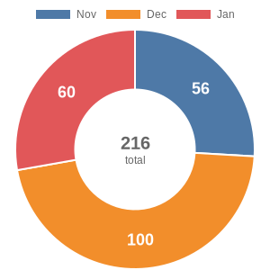

# ado-pr-chart

Quickly generate a PR chart for your ADO repositories, grouped per month.



## Usage

Use the command line to pass the following arguments:

- `--ado-org`: the name of the Organization in ADO
- `--ado-proj` the name of the Project in ADO
- `--ado-repo` the UUID of the Repository in ADO
- `--ado-pat`: a PAT for ADO with scope vso.code
- `--start-date`: the date from when to start counting. Format=yyyyMMdd
- (optional) `--pr-status`: the status of the requested PR [completed, active, abandoned, any]
- (optional) `--page-size`: the number of items you wish to receive (REST API defaults to 100)

or create an `appsettings.json` file based on the template and use the `-f` flag to run

```
ado-pr-chart.exe -f 
```

### How to find the repository UUID

- Go to Repository Settings in ADO: <https://dev.azure.com/>\<Organization>/\<Project>/_settings/repositories
- Select the repository you are interested in
- Look at the URL bar in your browser, there is a UUID at the end: `_settings/repositories?repo=xxxxxxxx-xxxx-xxxx-xxxx-xxxxxxxx`

## Open Topics

- [ ] save the image to a file (currently only displays the link)
- [ ] make colors customizable
- [ ] provide ability to choose fonts, colors and size
- [ ] decent error handling
- [ ] show help output when wrong arguments are provided
- [x] Add instructions how to find Repository UUID
- [x] Fix hardcoded date

## Dependencies

- [QuickChart](https://quickchart.io/) / [QuickChart-C#](https://github.com/typpo/quickchart-csharp) Simple online service and Client SDK to generate charts on the fly.
- [commandlineparser](https://github.com/commandlineparser/commandline) Best Commandline argument parser for netcore.
- [Newtonsoft.JSON / JSON.NET](https://www.newtonsoft.com/json) the default library for JSON in netcore.
